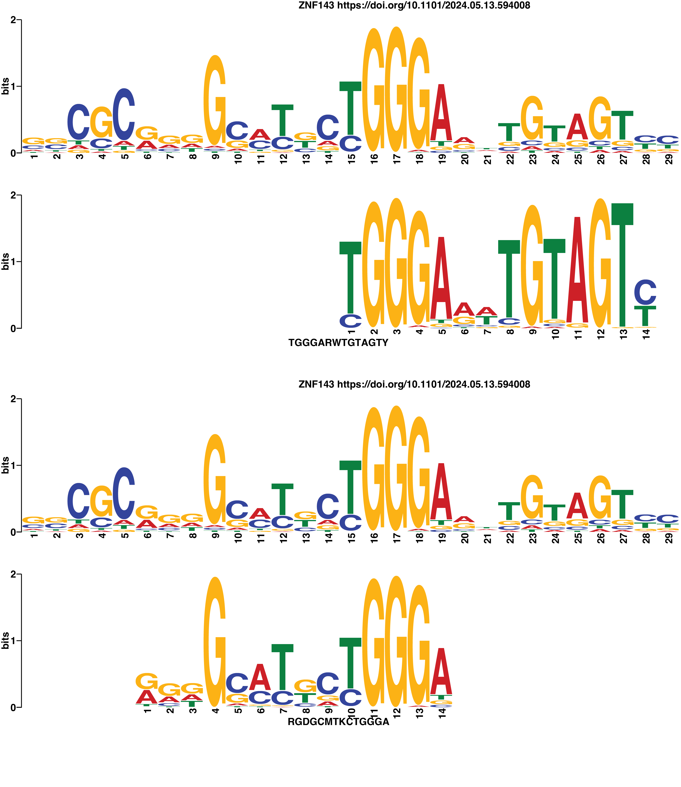
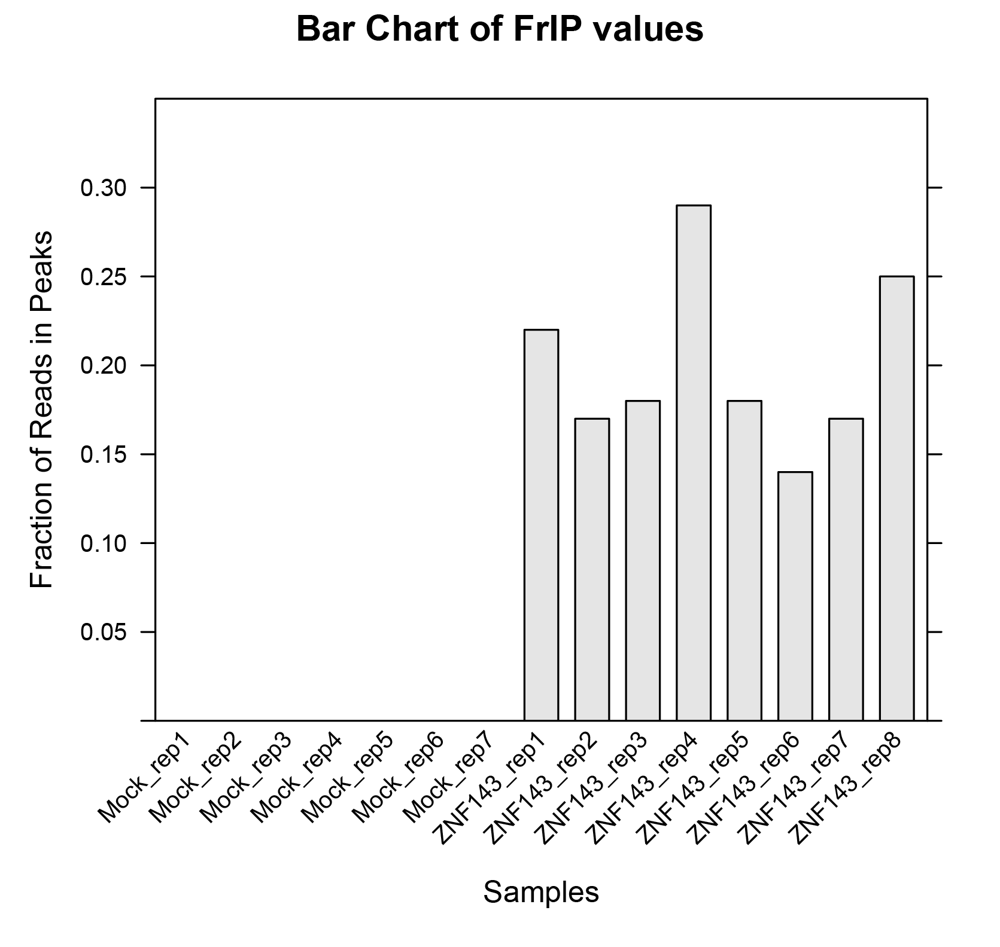
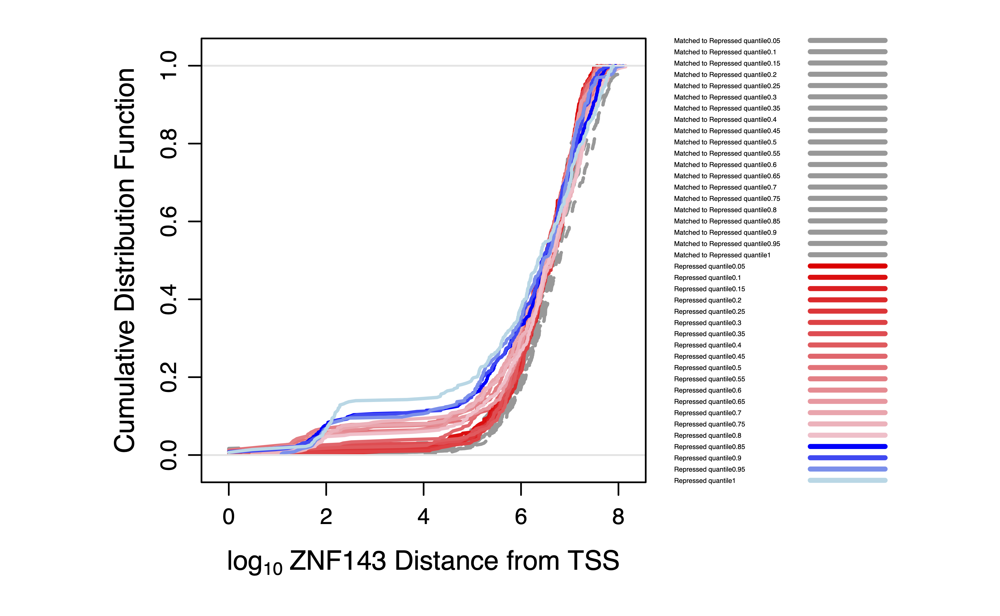
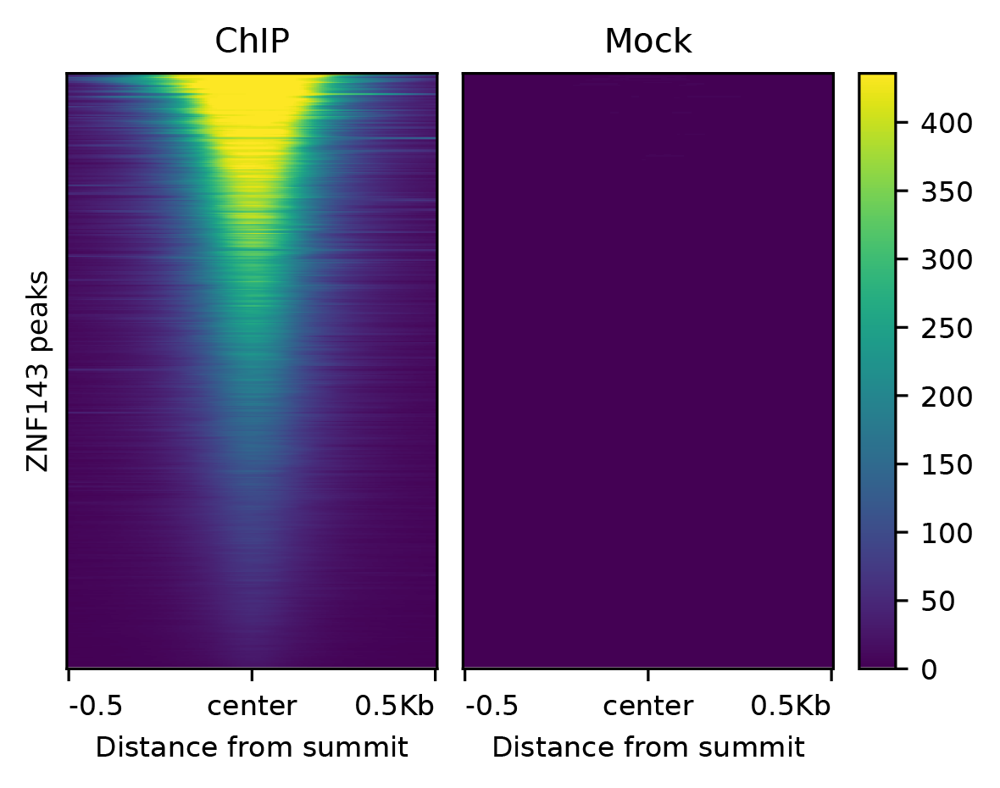
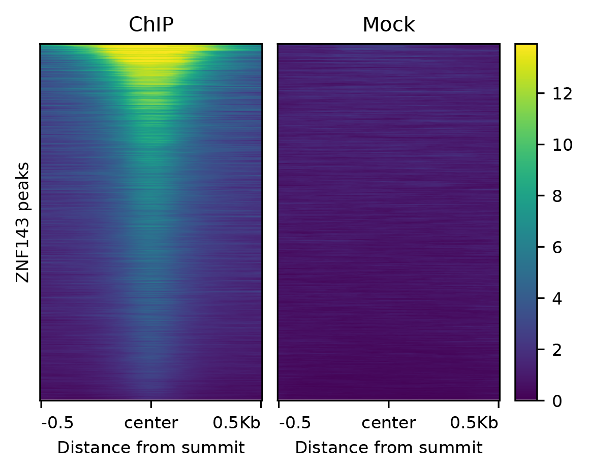
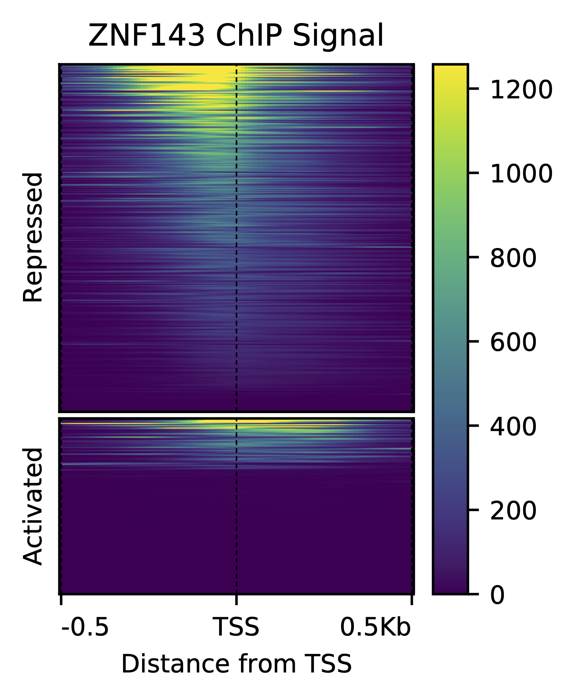
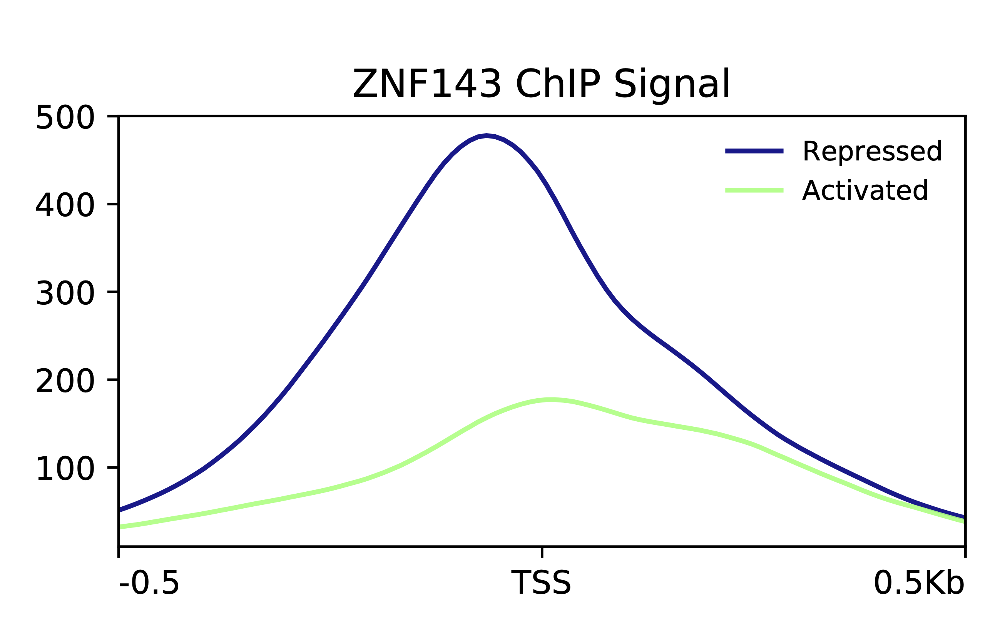

```{css, echo=FALSE}
body .main-container {
  max-width: 1600px !important;
  width: 1600px !important;
}
body {
  max-width: 1600px !important;
}

pre {
  max-height: 600px;
  overflow-y: auto;
}

pre[class] {
  max-height: 600px;
}
```

# ChIP-seq experiments

ChIP-seq measures protein abundance on DNA and one can quantify protein modifications if an antibody to the modification is available. 

# ChIP-seq experimental design

We performed ChIP-seq of HA-tagged ZNF143 in HEK-293T cells with mock IP (no antibody) as a control.  

# ChIP-seq analysis

In this vignette, grey code chunks are performed in bash, blue code chunks are performed in R, and red code chunks are not to be run by you (either we already ran them or will run them using all samples).

## Download your samples

We already named the experiments with the trailing name being `PE1` or `PE2` for paired end data. You can retrieve the files by substituting you group number (1-8) for `X` in the code below. 

```{r engine='bash', eval=F, echo=TRUE}
#Navigate to the class directory
cd ~/genex/

#Make a variable for your group number
rep=X

#Download the data
wget http://guertinlab.cam.uchc.edu/cshl_2024/HEK293T_Mock_rep${rep}_PE1.fastq.gz
wget http://guertinlab.cam.uchc.edu/cshl_2024/HEK293T_Mock_rep${rep}_PE2.fastq.gz
wget http://guertinlab.cam.uchc.edu/cshl_2024/HEK293T_ZNF143_rep${rep}_PE1.fastq.gz
wget http://guertinlab.cam.uchc.edu/cshl_2024/HEK293T_ZNF143_rep${rep}_PE2.fastq.gz
```

## Cut off the adapter with `cutadapt`

In our daily workflow in the lab we use
`cutadapt` to remove adapter sequences. The options we use below are:

- `-j` for the number of cores to use
- `-m` specifies the minimal length of a read to keep after adapter sequence removal
- `-O` is the number of bases to trim off the end of the read if it overlaps with the adapter sequence 
- `-a` adapter sequence of PE1 reads 
- `-A` adapter sequence of PE2 reads
- `-o` PE1 output file 
- `-p` PE2 output file

The last two positional arguments are the input `fastq` files. Save the output
to a log file.

If the genome contains 25% of each base, then you would expect one quarter of the
reads that have no adapter to have the trailing base
trimmed. Likewise, approximately 1/16 of the remaining
reads without the adapter will have the final two bases
trimmed. Technically these values are not exact, because the reads with
matches to longer trailing k-mers (in this case 19-mers) would be
removed first, then 18-mer matches removed, etc. Each group has two sets of files: the experimental and the control. We can process these both in series using a loop that determines the output file names from the processed input files and performs the same operation on each set of files.  


```{r engine='bash', eval=F, echo=TRUE}
for i in *PE1.fastq.gz
do
    name=$(echo $i | awk -F"/" '{print $NF}' | awk -F"_PE1" '{print $1}')
    echo $name
    echo unzipping $i
    gunzip $i
    echo unzipping ${name}_PE2.fastq.gz
    gunzip ${name}_PE2.fastq.gz
    cutadapt -a AGATCGGAAGAGCACACGTCTGAACTCCAGTCA -A AGATCGGAAGAGCGTCGTGTAGGGAAAGAGTGT -j 8 -m 10 -O 1 -o ${name}_PE1_no_adapt.fastq -p ${name}_PE2_no_adapt.fastq ${name}_PE1.fastq ${name}_PE2.fastq 2>&1 | tee ${name}_cutadapt.log
done
```
## Align to the human genome

Now we are aligning to the `hg38.fa` genome. We first need to "build" a set of index files for the hg38 genome. These files are necessary so the `bowtie2` software can efficiently search the genome for the input sequences. You can Google and click around the UCSC genome browser website to find genome files, but the code to download from the Terminal is shown below. We also need a file that has all the information about chromosome sizes later in the vignette, so we will download that as well. Next, we make a `genex` folder in the home directory and a `genomes` file in the `genex` directory, then move these files the files to the `genomes` folder and navigate to this directory. Finally, we can build the indicies with `bowtie2-build`. This takes a bit of time and we only need to perform these actions once per genome, so we already did this for you. You will have a chance to build the mitochondrial DNA chromosome alignment indicies later when you analyze ATAC data.

```{r engine='bash', class.source="bg-danger", eval=F, echo=TRUE}
# Make a directory for the genome files
mkdir ~/genex/genomes

#navigate to this directory 
cd ~/genex/genomes

#download the genome file
wget https://hgdownload.soe.ucsc.edu/goldenPath/hg38/bigZips/hg38.fa.gz

#unzip
gunzip hg38.fa.gz

# build indicies
bowtie2-build hg38.fa hg38_bt2

```

Note that the libraries are paired end. The `-1` and `-2` options are for the respective paired-end `fastq` files. There is no need to save the output `sam` file, so the output is piped to `samtools` to convert to `bam`, then sorted by name (`-n`) so paired end reads are adjacent in the file, then piped to `samtools fixmate` which adds information about the fragment length by comparing the PE1 and PE2 coordinates. Then the files are sorted by coordinate and piped to `samtools markdup` to remove duplicate reads. Duplicate reads have the same PE1 and PE2 ends. This is very unlikely to happen by chance unless you sequence to very high read depth, so these reads are considered PCR amplicon duplicates. The `fixmate` step is necessary to pipe to `markdup`. We use the entire DNA fragment for making the browser tracks, which is accomplished by converted the paired-end `bam` file to a `bed12` and taking out discordant reads. We are defining discordant as the two ends of the DNA fragments being greater that 2kb away from one another. This is unlikely given the size of or sonicated DNA and the Illumina sequencing platform. Then we normalize to read depth, add a trackline so we can upload into the UCSC genome browser, and make a `bigWig` file, which is very similar to a `bedGraph`, but it binary and not human-readable. 


The software `seqOutBias` software incorporates whether a read is uniquely mappable when converting a `bam` file to a `bed` and `bigWig`. This requires a compute-intensive task of looking at all k-mers (sequencing read length, here it is 40 bases) in the genome and determining if they are unique. Since this takes a bit of time, we performed this task for you and the resultant files are within the `~/genex/genomes/` directory.  

```{r engine='bash', class.source="bg-danger", eval=F, echo=TRUE}
# generate mappability file
seqOutBias seqtable hg38.fa --read-size=40

#Go back to the above directory
cd ..
```

The following is the alignment and processing code that you will execute. 

```{r engine='bash', eval=F, echo=TRUE}
sizes=~/genex/genomes/hg38.chrom.sizes
genome=~/genex/genomes/hg38.fa
genome_index=~/genex/genomes/hg38_bt2
tallymer=~/genex/genomes/hg38.tal_40.gtTxt.gz
table=~/genex/genomes/hg38_40.4.2.2.tbl

ncore=7
readLength=40

#download a file that lists the size of chromosomes
wget -P ~/genex/genomes/ https://hgdownload.soe.ucsc.edu/goldenPath/hg38/bigZips/hg38.chrom.sizes

cd ~/genex/
for i in *_PE1_no_adapt.fastq
do
	name=$(echo $i | awk -F"/" '{print $NF}' | awk -F"_PE1" '{print $1}')
	echo $name	
	bowtie2 -p $ncore --maxins 800 -x $genome_index -1 ${name}_PE1_no_adapt.fastq -2 ${name}_PE2_no_adapt.fastq | samtools view -bS -f 0x2 - | samtools sort -@ $ncore -n | samtools fixmate -m - - | samtools sort - | samtools markdup -s -r - ${name}.hg38.bam 2>&1 | tee ${name}_bowtie2_hg38.log
	seqOutBias scale $table ${name}.hg38.bam --tallymer=$tallymer --shift-counts --no-scale --bw=${name}.bigWig --read-size=${readLength} 2>&1 | tee ${name}_seqOutBias.log
	samtools sort -@ $ncore -n ${name}.hg38.bam -o ${name}.sorted.hg38.bam
	bedtools bamtobed -i ${name}.sorted.hg38.bam -bedpe > ${name}_bed12.bed
	awk '$1==$4 {print $0}' ${name}_bed12.bed | awk '{OFS="\t";} {print $1, $2, $6}' | awk '$1!="." && $3>$2 && (($3 - $2)<2000) {print $0}' | sort -k1,1 -k2,2n > ${name}_read_span.bed
	genomeCoverageBed -bg -i ${name}_read_span.bed -g $sizes > ${name}.bedGraph
	depth=`awk -F'\t' '{sum+=$5;}END{print sum;}' ${name}.hg38_not_scaled.bed`
	scaled=$(bc <<< "scale=3 ; 10000000 / $depth")
	echo $scaled
	awk -v scaled="$scaled" '{OFS="\t";} {print $1, $2, $3, $4*scaled}' ${name}.bedGraph > ${name}_normalized.bedGraph
	awk -v var="$name" 'BEGIN {  print "browser position chr11:5,289,521-5,291,937"; print "track type=bedGraph name=\"" var "\" description=\"" var "_bedGraph\" visibility=full autoScale=on alwaysZero=on color=0,125,0 windowingFunction=maximum"}  { print $0}' ${name}_normalized.bedGraph > ${name}_ucsc.bedGraph
	wigToBigWig -clip ${name}_normalized.bedGraph $sizes ${name}_normalized.bigWig
	gzip ${name}_PE1_no_adapt.fastq
	gzip ${name}_PE2_no_adapt.fastq
	gzip ${name}_PE2.fastq
	gzip ${name}_PE1.fastq
done
```

# Combining replicates for the genome browser

Usually we combine replicates into a single track for visualization
and we compare the tracks between conditions. It is important that we
read-depth normalize before we combine the signal from each
replicate. Otherwise, we would be weighting replicates differently;
for example, if a library is sequenced to twice the read depth and we
combine first then read depth normalize, then the more high coverage
data is weighted twice as much in the final visualization. We will perform this step for the class, since you are all operating on your individual replicates independently. 


```{r engine='bash', class.source="bg-danger", eval=F, echo=TRUE}
#!/bin/bash
sizes=~/genex/genomes/hg38.chrom.sizes

for i in *rep1_PE1.fastq.gz
do
    nm=$(echo $i | awk -F"/" '{print $NF}' | awk -F"_PE1.fastq.gz" '{print $1}')
    name=$(echo $nm | awk -F"_rep1" '{print $1}')
    echo $name
    reps=$(ls ${name}_rep*normalized.bigWig | wc -w | bc)
    echo $reps
    files=$(ls ${name}_rep*normalized.bigWig)
    echo $files
    bigWigMerge ${name}_rep*normalized.bigWig tmp.bg
    scaleall=$(bc <<< "scale=4 ; 1.0 / $reps")
    echo scale:
    echo $scaleall
    awk -v scaleall="$scaleall" '{OFS="\t";} {print $1, $2, $3, $4*scaleall}' tmp.bg > ${name}_normalized.bedGraph
    rm tmp.bg
    wigToBigWig ${name}_normalized.bedGraph $sizes ${name}.bigWig
    awk -v var="$name" 'BEGIN {  print "browser position chr11:5,289,521-5,291,937"; print "track type=bedGraph name=\"" var "\" description=\"" var "_bedGraph\" visibility=full autoScale=on alwaysZero=on color=0,0,0"}  { print $0}' ${name}_normalized.bedGraph > ${name}_header_normalized.bedGraph
    gzip ${name}_header_normalized.bedGraph
done
```

# Using the UCSC genome browser

We will take the file `${name}_header_normalized.bedGraph` and upload to UCSC. We can only upload `bedGraph` files with 50 million lines to UCSC, so I truncated the files. There is missing data several chromosomes. You can visualize the merged data here: https://genome.ucsc.edu/s/Mike%20Guertin/GeneX_ChIP_2024

# Peak calling

The next step is to use the aligned reads to call peaks. The code below will work if you have 1 replicate or many replicates. You will call peaks with your single replicate. We will combine the replicates and use the same command to get a peak set that uses all the replicates. We empirically found that this method typically captures the peaks of interest. If we were to call peaks in each replicate, we could combine peaks in various ways. The lower intensity peaks are the peaks that will change between replicates and these tend to be less important biologically. We believe it is important to have a single peak set per factor and we tend to be permissive with calling peaks and then try to determine which peaks to carry forward. Here we will determine an intensity threshold for peaks by only considering intensity quantiles of peaks that are enriched near genes that are changing expression when ZNF143 is degraded. In the past I have used the presence of a sequence motif or arbitrarily set a threshold for 2 orders of magnitude dynamic range to establish a threshold. 

```{r engine='bash', eval=F, echo=TRUE}
# call peaks  
macs3 callpeak --call-summits -t HEK293T_ZNF143_rep*.sorted.hg38.bam -c HEK293T_Mock_rep*.sorted.hg38.bam -n ZNF143_ChIP -g hs -q 0.01 --keep-dup all -f BAMPE --nomodel
```
## Removing peaks on contigs and within blacklisted regions

You can Google "blacklisted genomic regions" to find a
set of region in the genome in `bed` format that have an over-representation of
reads regardless of the experiment. Recall this is even more necessary
because we do not have a control data set. We can also remove peaks on non-canonical chromosomes with
`grep -v`. All intervals in the summits file span one base, so we extend this region by a fixed value for each peak using `slopBed`. These 101 base intervals will be used as input for de novo motif analysis. The 401 base intervals will be used to calculate peak intensity. The rationale for a smaller window for motif analysis is the following: 1) the motif is typically very close to the peak summit, 2) larger window increases the computation time substantially, and 3) the flanking sequence is less enriched for the relevant motifs and de novo motif analysis is less sensitive with higher noise relative to background. We use a standard window size to calculate peak intensity, but we use a much wider window because signal 200 bases up or downstream can result from signal. We could increase the window to 600 bases and that would be fine as well. You can vary this window systematically and determine if varying the window affects the relative peak intensity rank. We use the same window size for each peak because otherwise wider windows (note the `narrowPeaks` file outputs are variable width) would inherently have more reads. 

```{r engine='bash', eval=F, echo=TRUE}
wget https://github.com/Boyle-Lab/Blacklist/raw/master/lists/hg38-blacklist.v2.bed.gz
gunzip hg38-blacklist.v2.bed.gz
blacklist=hg38-blacklist.v2.bed
sizes=~/genex/genomes/hg38.chrom.sizes

# we only have one summits file (we only ChIPed one factor), but I am keeping the "loop" structure so it can be adapted for serial analysis.
for i in *_summits.bed
do
	name=$(echo $i | awk -F"/" '{print $NF}' | awk -F"_summits.bed" '{print $1}')
	echo $name
	grep -v "random" ${name}_summits.bed | grep -v "chrUn" | grep -v "chrEBV" | grep -v "chrM" | grep -v "alt" | intersectBed -v -a - -b $blacklist > ${name}_summits_final.bed
	slopBed -b 50 -i ${name}_summits_final.bed -g $sizes  | sort -k1,1 -k2,2n > ${name}_summit_100window.bed
   	slopBed -b 200 -i ${name}_summits_final.bed -g $sizes  | sort -k1,1 -k2,2n > ${name}_summit_400window.bed
done
```

# *De novo* motif analysis at peaks

The coordinate `bed` file is converted to a sequence `fasta` file, then we perform *de novo* motif analysis with `meme`. The lab performs motif analysis frequently, so we have many options invoked when we call `meme` below. You can always use `meme -h` to determine the function of each option/parameter.

```{r, engine='bash', eval=F, echo=T}
name=ZNF143_ChIP
genome=~/genex/genomes/hg38.fa
sizes=~/genex/genomes/hg38.chrom.sizes 

fastaFromBed -fi $genome -bed ${name}_summit_100window.bed -fo ${name}_summit_100window.fasta

meme -oc ${name}_motif.meme_output -nmotifs 2 -objfun classic -csites 20000 -searchsize 0 -minw 10 -maxw 15 -revcomp -dna -markov_order 3 -maxsize 100000000 ${name}_summit_100window.fasta

#I just did the top 2000 peaks to make it faster
sort -nrk5,5 ${name}_summit_100window.bed | head -n 2000 > ${name}_top2000_summit_100window.bed
name=${name}_top2000
fastaFromBed -fi $genome -bed ${name}_summit_100window.bed -fo ${name}_summit_100window.fasta
meme -oc ${name}_motif.meme_output -nmotifs 2 -objfun classic -csites 20000 -searchsize 0 -minw 10 -maxw 30 -revcomp -dna -markov_order 3 -maxsize 100000000 ${name}_summit_100window.fasta

#I ran this command:
#tomtom -no-ssc -oc de_novo -verbosity 1 -min-overlap 5 -dist ed -evalue -eps -thresh 5.0 ~/genex/ZNF143_ChIP_top2000_motif.meme_output/meme.txt motif_database.txt
```

When we did this with the top 2000 most significant peaks using all replicates, we found 2 motifs, both of which match with the ZNF143 motif:

```{r echo=F, fig.align = "center", out.width="400px", fig.cap="First de novo identified motif matched to the THAP11 motif with TOMTOM"}
#library(knitr)
 
```

# Fraction of Reads in Peaks (FRiP) 

A common metric to assess the quality of ChIP-seq data is fraction of reads in peaks. This can be informative, but let's go in depth about this metric. If we reduce the stringency of peak calling, then we have more genomic regions and FRiP increases—so we can have any number of FRiP score for one set of data. Also peak sets change between datasets. If we call peaks with two different replicates and call peaks in each, then we have two different peaks sets and it is not fair to compare FRiP between them. To avoid this we call a set of universal peaks for a factor; recall that we just use all `bam` files and perform one peak calling step. Next we count reads in this universal peak set for all replicates and we can directly compare FRiP between replicates.    

## Counting reads in peaks 

The `mapBed` subcommand from `bedtools` counts the BED file from the `seqOutBias` output in the 400 base window peak summits file. The `samtools` commands counts the number of paired end 1 reads that aligned in a concordant pair (the mate aligned nearby). The final output file contains these two values that we use to calculate FRiP.

```{r engine='bash', eval=F, echo=TRUE}
#We did this using the peaks called with all the samples (don't run this)
name=ZNF143_ChIP
sort -k1,1 -k2,2n ${name}_summit_400window.bed > ${name}_summit_window_sorted.bed
wget https://raw.githubusercontent.com/guertinlab/genex/main/ChIP_analysis/ZNF143_functional_peaks.bed
intersectBed -u -a ZNF143_ChIP_summit_window_sorted.bed -b ZNF143_functional_peaks.bed > ZNF143_ChIP_functional_summit_window_sorted.bed

#You can download the file here
wget https://raw.githubusercontent.com/guertinlab/genex/main/ChIP_analysis/ZNF143_ChIP_functional_summit_window_sorted.bed
peaks=ZNF143_ChIP_functional_summit_window_sorted.bed
sort -k1,1 -k2,2n ZNF143_ChIP_summit_400window.bed > ZNF143_ChIP_summit_400window_sorted.bed
summitWin=ZNF143_ChIP_summit_400window_sorted.bed
for i in *_not_scaled.bed
do
	nm=$(echo $i | awk -F"/" '{print $NF}' | awk -F"_not_scaled.bed" '{print $1}')
	sort -k1,1 -k2,2n $i > ${nm}_sorted.bed
	mapBed -null '0' -a $peaks -b ${nm}_sorted.bed > ${nm}_peak_counts.txt
	mapBed -null '0' -a $summitWin -b ${nm}_sorted.bed > ZNF143_ChIP_summit_counts.bed
done

for i in *_peak_counts.txt
do
	name=$(echo $i | awk -F"/" '{print $NF}' | awk -F"_peak_counts.txt" '{print $1}')
	echo $name > ${name}_FRiP.txt
	awk '{print $NF}' ${name}_peak_counts.txt > ${name}_peak_counts_only.txt
	RiP=$(awk '{sum+=$1;} END{print sum;}' ${name}_peak_counts_only.txt)
	echo $name | cat - ${name}_peak_counts_only.txt > ${name}_peak_counts.txt
	aligned_reads=$(samtools view -c -f 0x42 ${name}.bam)
	FRiP=$(echo "scale=2 ; $RiP / $aligned_reads" | bc)
	echo $FRiP >> ${name}_FRiP.txt
	rm ${name}_peak_counts_only.txt
done

echo -e "chr\tstart\tend\tname\tqvalue" | cat - $peaks | paste -d'\t' - *peak_counts.txt > Combined_ZNF143_peak_counts.txt
echo -e "Name" > rowname.txt
echo -e "FrIP" >> rowname.txt
paste -d'\t' rowname.txt *.hg38_FRiP.txt > Combined_ZNF143_FRiP.txt
rm rowname.txt
```

```{r echo=F, fig.align = "center", out.width="400px", fig.cap="Fraction of Reads in Peaks"}
#library(knitr)
 
```

# Which ZNF143 peaks functionally regulate transcription?

More appropriately, the following analyses provide a range of intensity values of peaks that have the potential to regulate gene expression. Stated differently, we are empirically determining a threshold that we can use that is the lower bound of a potentially _functional_ peak. Please keep in mind that many of the peaks above this threshold may not functionally regulate gene expression because they are not proximal to genes or other biological reasons. However, we can be fairly confident that peaks below this threshold are not regulating an appreciable amount of transcription.  


Navigate to your `/Users/admin/genex` folder and open `R`. We performed PRO-seq after 30 minutes of ZNF143 degradation and identified activated and repressed genes. We also found comparable genes that are unchanged, but matched for the expression levels. We are going to ask "for each of these genes sets, how far away do we have to move from the transcription start site to find the first ZNF143 peaks in each quantile?"

```{r echo=F, fig.align = "center", out.width="400px", fig.cap="TFs tend to act near their gene targets"}
#library(knitr)
knitr::include_graphics("230731_CSHL_GeneX.png") 
```

```{r echo=F, fig.align = "center", out.width="400px", fig.cap="The CDF metric quantifies how far away we need to go from the class of genes to find the first TF binding site and plots the cumulative distribution."}
#library(knitr)
knitr::include_graphics("230731_CSHL_GeneX_2.png") 
```

```{r echo=F, fig.align = "center", out.width="600px", fig.cap="TF binding sites are closer to their direct gene targets."}
#library(knitr)
knitr::include_graphics("230731_CSHL_GeneX_3.png") 
```

```{r echo=F, fig.align = "center", out.width="400px",  fig.cap="A classic example is the Estrogen receptor, which is an activator that is stimulated by the addition of estrogen. "}
#library(knitr)
knitr::include_graphics("230731_CSHL_GeneX_4.png") 
```

## Ranking and quantile parsing of ChIP peaks

The first step is to generate BED files that are ranked by their intensity, parsed into separate files, and named according to their quantile.
```{r class.source="bg-info", engine='R', eval=F, echo=T}
setwd("~/genex/")

#libraries
library(DESeq2)
library(lattice)
library(dplyr)
library(ggplot2)
library(limma)
library(bigWig)

peak.intensities = read.table('ZNF143_ChIP_summit_counts.bed', header =FALSE)

chr = peak.intensities$V1
start =	peak.intensities$V2
end = peak.intensities$V3

quantile(peak.intensities$V6, probs = seq(.05, 1.00, by = .05))

j =0 
q=seq(.05, 1.00, by = .05)
count=0
for (i in quantile(peak.intensities$V5, probs = seq(.05, 1.00, by =
.05)))
{
count = count +1

write.table(file = paste0('quantile', as.character(q[count]), '.bed'), peak.intensities[peak.intensities$V5 > j & peak.intensities$V5 <= i,], sep = '\t', quote=FALSE, col.names=FALSE, row.names=FALSE )
j = i
}
```
## Integration with PRO-seq data

We degraded ZNF143 for 30 minutes and performed PRO-seq. We can use these data to determine if ZNF143 is activating genes and estimate the dynamic range of peak intensities that are detectably regulating gene expression (so-called functional peaks).

Download the activated, repressed, and matched files from `https://github.com/guertinlab/genex/tree/main/ChIP_analysis`. Concatenate these files into a list of activated and repressed genes that change upon ZNF143 depletion and their matched genes.

```{r engine='bash', eval=F, echo=TRUE}
wget https://raw.githubusercontent.com/guertinlab/genex/main/ChIP_analysis/treated_activated_genes.bed
wget https://raw.githubusercontent.com/guertinlab/genex/main/ChIP_analysis/treated_repressed_genes.bed
wget https://raw.githubusercontent.com/guertinlab/genex/main/ChIP_analysis/treated_activated_matched_genes.bed
wget https://raw.githubusercontent.com/guertinlab/genex/main/ChIP_analysis/treated_repressed_matched_genes.bed

cat treated_activated_genes.bed treated_activated_matched_genes.bed treated_repressed_genes.bed treated_repressed_matched_genes.bed > /Users/admin/genex/HEK_ZNF143_gene_annotations.bed
```

## Making CDF plots

There are many methods to generate and visualize CDF plots and we have developed many functions in `R` that perform these tasks. The first ten lines import common libraries that are preinstalled on CSHL computers and the last three of the preamble lines import some functions that we use routinely in the lab.

```{r class.source="bg-info", engine='R', eval=F, echo=T}
library(latticeExtra)
library(DESeq2)
library(lattice)
library(dplyr)
library(ggplot2)
library(limma)
library(bigWig)
install.packages("gplots")
source('https://raw.githubusercontent.com/guertinlab/seqOutBias/master/docs/R/seqOutBias_functions.R')
source('https://raw.githubusercontent.com/mjg54/znf143_pro_seq_analysis/master/docs/ZNF143_functions.R')
source('https://raw.githubusercontent.com/guertinlab/genex/main/ChIP_analysis/cdf_functions.R')

col.lines = c("#FF0000", "grey60")

gene.file=read.table(file = "/Users/admin/genex/HEK_ZNF143_gene_annotations.bed", sep="\t", header=FALSE)
cat = "Repressed"

for (chip.peak in Sys.glob(file.path("/Users/admin/genex/quantile*bed"))) {
    print(chip.peak)
    quantile.name = strsplit(strsplit(chip.peak, "/")[[1]][length(strsplit(chip.peak, "/")[[1]])], '.bed')[[1]][1]
    print(quantile.name)
    df.all = cdf.deseq.df(genes = gene.file, chip.peaks=read.table(chip.peak, header=FALSE), cat = cat)
    plot_cdf(df.all, tf = quantile.name, cat = cat)
    }
    
df.cdf = data.frame(matrix(nrow = 0, ncol = 3))     
colnames(df.cdf) = c("V4", "dis", "status")
for (chip.peak in Sys.glob(file.path("/Users/admin/genex/quantile*bed"))) {
    print(chip.peak)
    quantile.name = strsplit(strsplit(chip.peak, "/")[[1]][length(strsplit(chip.peak, "/")[[1]])], '.bed')[[1]][1]
    print(quantile.name)
    df.all = cdf.deseq.df(genes = gene.file,
    	chip.peaks=read.table(chip.peak, header=FALSE),
	cat = cat)
    x = paste(as.character(df.all[,3]), quantile.name)
    df.all[,3] = x
    df.cdf = rbind(df.cdf, df.all)
    #plot_cdf(df.all, tf = quantile)
    }

plot_cdf(df.cdf, tf = "ZNF143", cat = cat, col.lines = c(rep("grey60",20),colorRampPalette(c("red","pink"))(16),colorRampPalette(c("blue", "light blue"))(4)), line.type = c(rep(2, 20), rep(1,20)), cex = 0.25)
#plot_cdf(df.cdf, tf = "ZNF143", cat = cat, col.lines = c(rep("grey60",20),colorRampPalette(c("red","pink"))(20)), line.type = c(rep(2, 20), rep(1,20)), cex = 0.25)

#Let's choose a cutoff of 0.85
quantiles = quantile(peak.intensities$V5, probs = seq(.05, 1.00, by = .05))
write.table(quantiles[16][[1]], file = "cutoff.txt", col.names = F, row.names = F, quote = F)

#Activated genes
cat = "Activated"

for (chip.peak in Sys.glob(file.path("/Users/admin/genex/quantile*bed"))) {
    print(chip.peak)
    quantile.name = strsplit(strsplit(chip.peak, "/")[[1]][length(strsplit(chip.peak, "/")[[1]])], '.bed')[[1]][1]
    print(quantile.name)
    df.all = cdf.deseq.df(genes = gene.file, chip.peaks=read.table(chip.peak, header=FALSE), cat = cat)
    plot_cdf(df.all, tf = quantile.name, cat = cat)
    }
    
df.cdf = data.frame(matrix(nrow = 0, ncol = 3))     
colnames(df.cdf) = c("V4", "dis", "status")
for (chip.peak in Sys.glob(file.path("/Users/admin/genex/quantile*bed"))) {
    print(chip.peak)
    quantile.name = strsplit(strsplit(chip.peak, "/")[[1]][length(strsplit(chip.peak, "/")[[1]])], '.bed')[[1]][1]
    print(quantile.name)
    df.all = cdf.deseq.df(genes = gene.file,
    	chip.peaks=read.table(chip.peak, header=FALSE),
	cat = cat)
    x = paste(as.character(df.all[,3]), quantile.name)
    df.all[,3] = x
    df.cdf = rbind(df.cdf, df.all)
    #plot_cdf(df.all, tf = quantile)
    }

levels = levels(factor(df.cdf$status))
levels = c(levels[grepl("Matched", levels)], levels[!grepl("Matched", levels)])
df.cdf$status = factor(df.cdf$status, levels = levels)
plot_cdf(df.cdf, tf = "ZNF143", cat = cat, col.lines = c(rep("grey60",20),colorRampPalette(c("red","pink"))(18), colorRampPalette(c("blue", "light blue"))(2)), line.type = c(rep(2, 20), rep(1,20)), cex = 0.25)
```

```{r echo=F, fig.align = "center", out.width="400px", out.height="100%", fig.cap="More intense ZNF143 ChIP peaks are more likely to be close to ZNF143-regulated genes"}
#library(knitr)
 
```
```{r echo=F, fig.align = "center", out.width="400px", out.height="100%", fig.cap="More intense ZNF143 ChIP peaks are more likely to be close to ZNF143-regulated genes"}
#library(knitr)
knitr::include_graphics("ZNF143_FIG_cdf_compare_Reg_classes_Activated.png") 
```
## Look at the plots and decide a peak threshold

You can employ a Kolmogorov–Smirnov, which is an overused statistical test that will provide a test statistic p-value for pairwise comparison of CDF curves. However, in this course we will just decide on a threshold by looking at the plots one by one. 

We can use `awk` to parse the peak file to only include peaks with intensities above are threshold.

```{r, engine='bash', eval=F, echo=T}
cutoff=$(cat cutoff.txt)
awk -v cutoff=$cutoff -F"\t" '$5>cutoff' ZNF143_ChIP_summits_final.bed > ZNF143_functional_peaks.bed
awk -v cutoff=$cutoff -F"\t" '$5<=cutoff' ZNF143_ChIP_summits_final.bed > ZNF143_other_peaks.bed
```

# `deeptools` heatmap of ZNF143 functional and non-functional peaks

Remember to update "X" to your group number. Note the scale bar differences in the plots. 

```{r, engine='bash', eval=F, echo=T}
#Make a variable for your group number
rep=X

#Make the matrix for the functional peaks (this can be used for a composite profile as well)
computeMatrix reference-point --referencePoint center -b 500 -a 500 -p 2 --missingDataAsZero \
  -R ZNF143_functional_peaks.bed \
  -S HEK293T_ZNF143_rep${rep}_normalized.bigWig \
  HEK293T_Mock_rep${rep}_normalized.bigWig.bigWig \
  -o matrix_HA_ChIP_ZNF143_peaks.gz --outFileSortedRegions ZNF143_peaks_sorted_for_heatmap.bed
  
#Make the heatmap for the functional peaks
plotHeatmap -m matrix_HA_ChIP_ZNF143_peaks.gz -out heatmap_HA_ChIP_ZNF143_peaks.pdf --heatmapHeight 7 \
   --regionsLabel "ZNF143 peaks" --xAxisLabel "Distance from summit" \
   --samplesLabel "ChIP" "Mock" --colorMap viridis --whatToShow "heatmap and colorbar" 
      
#Make the matrix for the other peaks
computeMatrix reference-point --referencePoint center -b 500 -a 500 -p 2 --missingDataAsZero \
  -R ZNF143_other_peaks.bed \
  -S HEK293T_ZNF143_rep${rep}_normalized.bigWig \
  HEK293T_Mock_rep${rep}_normalized.bigWig \
  -o all_matrix_HA_ChIP_ZNF143_peaks.gz --outFileSortedRegions other_ZNF143_peaks_sorted_for_heatmap.bed
  
#Make the heatmap for the other peaks
plotHeatmap -m all_matrix_HA_ChIP_ZNF143_peaks.gz -out other_heatmap_HA_ChIP_ZNF143_peaks.pdf --heatmapHeight 7 \
   --regionsLabel "ZNF143 peaks" --xAxisLabel "Distance from summit" \
   --samplesLabel "ChIP" "Mock" --colorMap viridis --whatToShow "heatmap and colorbar" 
```

```{r echo=F, fig.align = "center", out.width="500px", fig.cap="More likely to be functional ZNF143 ChIP peaks"}
#library(knitr)
 
```

```{r echo=F, fig.align = "center", out.width="500px", fig.cap="Less likely to be functional ZNF143 ChIP peaks (note the color range)"}
#library(knitr)

```

# `deeptools` heatmap of ZNF143 binding intensity around TSS's

Remember from our CDFs that ZNF143 binding is also proximal to a subset of the genes that are activated by ZNF143 depletion. How could this be, if we're claiming that ZNF143 is an activator? One hypothesis that, at these activated genes, ZNF143 is binding downstream from the TSS, activating transcription that is interfering with transcription of the gene. Thus, loss of this transcriptional activation leads to an activation of the local gene. In contrast, we would predict that ZNF143 would bind upstream (in the promoter) from the genes repressed by ZNF143 depletion. Here we plot the ZNF143 binding intensity around the TSS's of activated and repressed genes. 

```{r, engine='bash', eval=F, echo=T}
#Make the matrix
computeMatrix reference-point --referencePoint TSS -b 500 -a 500 -p 7 --missingDataAsZero \
  -R treated_repressed_genes.bed treated_activated_genes.bed\
  -S HEK293T_ZNF143_rep${rep}_normalized.bigWig \
  -o matrix_HA_ChIP_ZNF143_peaks_TSS.gz --outFileSortedRegions ZNF143_TSS_sorted_for_heatmap.bed
  
#Make the heatmap
plotHeatmap -m matrix_HA_ChIP_ZNF143_peaks_TSS.gz -out heatmap_HA_ChIP_ZNF143_peaks_TSS.pdf --heatmapHeight 7 \
	--regionsLabel "Down" "Up" --xAxisLabel "Distance from TSS" --samplesLabel "ZNF143 ChIP Signal" \
	--colorMap viridis -min 0 --whatToShow "heatmap and colorbar" --linesAtTickMarks

#Plot the profile
plotProfile -m matrix_HA_ChIP_ZNF143_peaks_TSS.gz -out profile_HA_ChIP_ZNF143_peaks_TSS.pdf --regionsLabel "Down" "Up" --samplesLabel "ZNF143 ChIP Signal"
```

```{r  out.width = "500px", echo=F, fig.align = "center", fig.cap="Heatmap of ZNF143 binding intensity around TSS's for down and up genes upon ZNF143 depletion"}
library(knitr)
 
```

```{r  out.width = "500px", echo=F, fig.align = "center", fig.cap="Profile of ZNF143 binding intensity around TSS's for down and up genes upon ZNF143 depletion"}
library(knitr)
 
```
